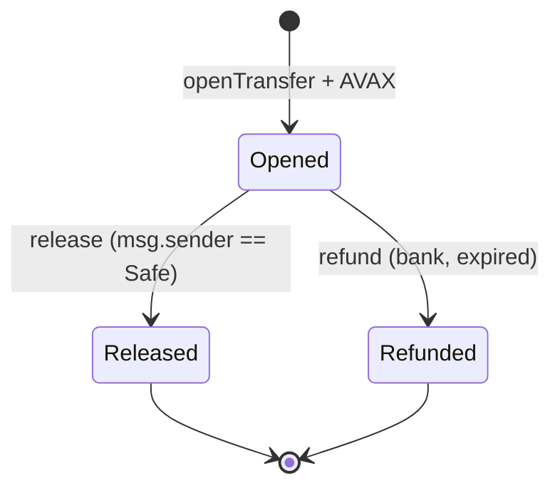
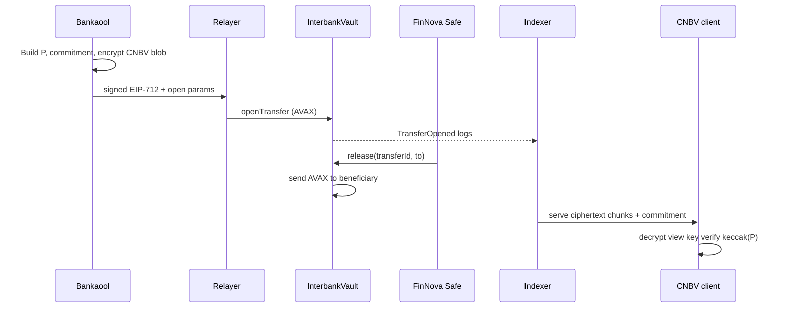

# Design: InterbankVault MVP (AVAX + Safe + auditoría CNBV)

## Technical approach

Un contrato **stateful** custodia AVAX por `transferId`. **Apertura**: banco envía AVAX + prueba EIP-712 que amarra `commitment`, `amount`, `beneficiary`, nonces y expiración. **Liberación**: solo si `msg.sender == finNovaSafe`. **Reembolso/expiración**: banco recupera según reglas de tiempo. **CNBV**: no mueve fondos; recibe material cifrado en **logs** (chunk opcional) + `commitment` on-chain para verificar off-chain. Relayer/4337 queda **fuera** del TCB del vault (solo `msg.sender` del ejecutor).

## Architecture decisions

| Decision | Choice | Alternatives | Rationale |
|----------|--------|--------------|-----------|
| Custodia release | **Gnosis Safe** como único `msg.sender` permitido | Multisig custom; EOA | Auditoría pública del módulo Safe; empresa replica en horas |
| Activo | **AVAX nativo** | wAVAX / ERC-20 | Alineado a requisito; menos superficie |
| Intención banco | **EIP-712** + `ecrecover` | Solo `eth_sign` / hash opaco | Legibilidad institucional y verificación barata on-chain |
| Privacidad vs gas | **Hash + ciphertext en events** (chunks si hace falta) | Blob en storage; solo IPFS | Storage prohibitivo; IPFS añade dependencia |
| IDs | **`transferId = keccak256(abi.encodePacked(openHash, bank, nonce))`** o contador global `uint256` | UUID off-chain only | Único on-chain sin oracle |
| Nonces | **Por banco** (`mapping(address => uint256)`) | Global | Anti-replay simple por emisor |
| Expiración | **`expiry` bloque** en struct | Sin refund | Reduce fondos “atascados” en demo |

## State machine



*(MVP: **solo `refund` si `block.timestamp > expiry`**; sin `cancel` para menos superficie.)*

## Data flow (sequence)



## Interfaces (Solidity sketch)

```solidity
// Domain EIP-712: name, version, chainId, verifyingContract

struct Transfer {
  uint256 transferId;
  address bank;
  address beneficiary; // FinNova EOA o treasury; NO tiene que ser el Safe
  uint256 amount;
  bytes32 commitment;
  uint256 bankNonce;
  uint256 expiry;
}

// openTransfer: payable; verify EIP-712(Transfer); require(msg.value==amount);
// emit TransferOpened(transferId, bank, beneficiary, amount, commitment, cnbvCiphertext0..k, expiry);

function release(uint256 transferId, address payable to) external; // onlyFinNovaSafe; effects

function refund(uint256 transferId) external; // onlyBank + expired + state Opened
```

**Invariantes MUST**: `address(this).balance >= sum(open amounts - released)`; no reentrancy en `release`/`refund` (checks-effects-interactions); `finNovaSafe` inmutable o **single admin timelock** post-MVP.

## Events & indexing

- `TransferOpened`: campos indexados sugeridos `transferId`, `bank`, `beneficiary`; `amount`; `commitment`; `expiry`; `bytes` ciphertext en **uno o varios** eventos si supera límite práctico (~24 KB total tx).
- `TransferReleased`, `TransferRefunded`: `transferId`, `to`, `amount`.
- Indexer: persiste chunks, expone API **solo autenticada** hacia panel CNBV.

## Security notes

| Threat | Mitigation |
|--------|------------|
| Replay EIP-712 | `bankNonce` + dominio contrato + chainId |
| Wrong Safe | `finNovaSafe` set en constructor/config immutable tras deploy |
| Reentrancy | CEI; `release`/`refund` no llaman contratos usuario |
| Relayer griefing | Firma banco amarra `amount`/`beneficiary`; relayer no puede alterar sin invalidar firma |
| CNBV key rotación | MVP: nueva clave = nuevo deploy o función admin acotada (documentar riesgo) |

## Deployment

1. Desplegar `InterbankVault(finNovaSafe, cnbvViewPubKey, eip712Name, eip712Version)`.
2. FinNova crea Safe en Fuji/C-Chain; owners m-of-n.
3. Verificar en explorador que `release` reverte si `msg.sender != finNovaSafe`.

## File changes (next execution phase)

| Path | Action |
|------|--------|
| `contracts/InterbankVault.sol` | Create |
| `contracts/libraries/EIP712.sol` | Create or OZ import |
| `script/Deploy.s.sol` | Create |
| `test/InterbankVault.t.sol` | Create |
| `foundry.toml` / `hardhat.config.*` | Create según stack elegido |

## Testing strategy

| Layer | Qué | Cómo |
|-------|-----|------|
| Unit | firmas, nonces, expiración, onlySafe | Foundry/Hardhat + ecrecover fixtures |
| Integration | flujo open→release→balance | fork Fuji o anvil |
| Negativo | EOA llama `release`, replay, refund antes de expiry | expect revert |

## Migration / rollout

No hay migración de datos. Rollout: Fuji → demo → misma bytecode en C-Chain mainnet con addresses productivas.

## Open questions

- [ ] ¿`beneficiary` fijo al `open` o param en `release`? (MVP: **fijado en `open`** amarrado al EIP-712 para menos ambigüedad.)
- [ ] ¿Un solo `cnbvViewPubKey` bytes (SECP256k1 uncompressed 65) vs formato libsodium? (MVP: **secp256k1** coherente con Ethereum.)
- [ ] Esquema exacto de chunking de ciphertext (tamaño máximo por evento).

## Next step

`sdd-tasks`: descomponer en tareas Foundry/Hardhat, scripts de deploy Fuji, y wire mínimo indexador.
